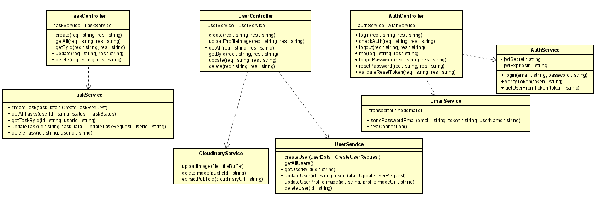
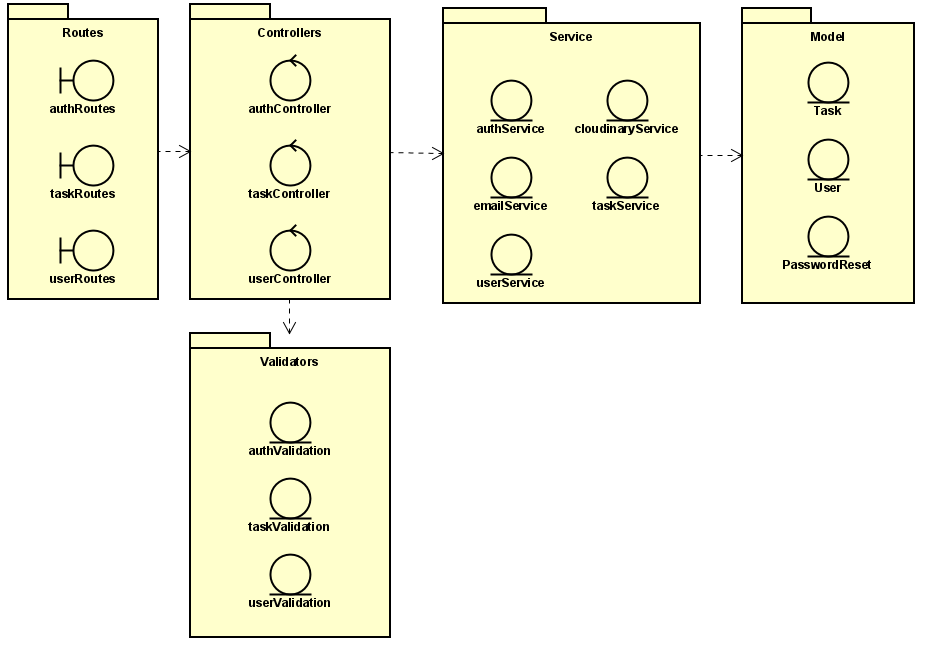
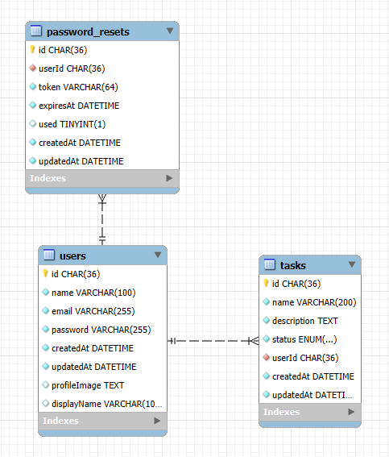

# 🎯 ToDo List

Projeto desenvolvido como solução para o desafio 2 do progama Zetta Lab 2025.

## 📌 Tecnologias Utilizadas

- [TypeScript](https://www.typescriptlang.org/)
- [SASS / SCSS](https://sass-lang.com/)
- [Bootstrap 5](https://getbootstrap.com/)
- [MySQL](https://www.npmjs.com/package/mysql2)
- [Nodemailer](https://nodemailer.com/)
- [Sequelize](https://sequelize.org/)
- [Express](https://expressjs.com/pt-br/)
- [Jsonwebtoken](https://www.npmjs.com/package/jsonwebtoken)
- [Jest](https://jestjs.io/)

## 📁 Estrutura do Projeto

```
├──frontend/
│   ├── public/ 
│   │ └── index.html # Porta de entrada da página
│   ├── src/ 
│   │ ├── components/ # Pastas com arquivos componentizados
│   │ │   ├── auth/ # Componentes de autenticação
│   │ │   ├── layout/ # Componentes de Header e Footer
│   │ │   └── tasks/ # Componentes de Tasks
│   │ ├── pages/ # Pastas com páginas
│   │ │   ├── DashboardPage.ts 
│   │ │   ├── ForgotPasswordPage.ts 
│   │ │   ├── LoginPage.ts 
│   │ │   ├── RegisterPage.ts 
│   │ │   └── ResetPasswordPage.ts
│   │ ├── services/ # Pastas com services
│   │ │   ├── AuthService.ts 
│   │ │   └── TaskService.ts
│   │ ├── styles/ # Estilos scss
│   │ │   ├── components
│   │ │   │  ├── _auth.scss
│   │ │   │  ├── _dashboard.scss
│   │ │   │  ├── _footer.scss
│   │ │   │  └── _header.scss
│   │ │   └── main.scss
│   │ ├── services/ # Pastas com definição das entidades
│   │ │   ├── Auth.ts 
│   │ │   └── Task.ts
│   │ ├── utils/ # Pasta com router
│   │ │   └── router.ts
│   │ └── main.ts # Porta de entrada da aplicação
│   ├── package-lock.json
│   └── package.json
├──src/
│   ├── config/ # Configurações de conexão com o banco de dados e Multer
│   ├── controllers/ # Pasta com controllers
│   │ ├── authController.ts
│   │ ├── taskController.ts
│   │ └── userController.ts
│   ├── middleware/ # Middleware de autenticação
│   │ └── authMiddleware.ts
│   ├── models/ # Entidades Sequelize
│   │ ├── index.ts
│   │ ├── PasswordReset.ts
│   │ ├── Task.ts
│   │ └── User.ts
│   ├── routes/ # Arquivos de rotas
│   │ ├── authRoutes.ts
│   │ ├── index.ts
│   │ ├── taskRoutes.ts
│   │ └── userRoutes.ts
│   ├── services/ # Pasta com services
│   │ ├── authService.ts
│   │ ├── cloudinaryService.ts
│   │ ├── emailService.ts
│   │ ├── taskService.ts
│   │ └── userService.ts
│   ├── utils/ # Pasta com validators
│   │ ├── authValidation.ts
│   │ ├── taskValidation.ts
│   │ └── userValidation.ts
│   └── index.ts # Porta de entrada da aplicação
├──images/ # Imagens usadas na documentação
├──__tests__/ # Arquivos de testes unitários
├── .dockerignore
├── .env 
├── .gitignore 
├── docker-compose
├── dockerfile
├── jest.config.js
├── package-lock.json 
├── package.json
├── README.md 
└── tsconfig.json                                        
```

## 📖 Diagramas

### Diagrama de Classe



### Diagrama de Pacote



### Modelo Entidade Relacionamento



## 🌐 Visão Geral

O projeto possui uma implementação completa de um sistema web, com autenticação por token, testes unitários, containerização com Docker e suporte à armazenamento de imagens na nuvem com Cloudinary. O usuário consegue a qualquer momento requisitar uma redefinição de senha, caso seja necessário, sendo as senhas criptografas. Emails de redefinição de senha são enviados com NodeMailer. As redefinições de senha são validadas com base em tokens armazenados em um banco de dados persistente, feito com MYSql e Sequelize. O projeto foi desenvolvido em TypeScript, para garantir maior segurança com tipagem, e Express para o roteamento. Todas as requisições enviadas à API, ao chegarem nos controllers, são verificadas e validadas por validators, que buscam por irregularidades nas requisições. O usuário autenticado consegue realizar um CRUD completo com as Tasks. O front end foi desenvolvido com TypeScript, BootStrap e Scss, seguindo todos os requisitos do primeiro desafio do Zetta Lab 2025.

## 🚀 Como Executar o Projeto

1. **Clone o repositório**:

```bash
git clone https://github.com/JoseJaan/ToDoList-Zetta
cd ToDoList-Zetta
```

2. **Instale as dependências**:
```bash
npm install
cd frontend
npm install
```

3. **Arquivo .env**:
- Na raíz do projeto, crie um arquivo .env e adicione os valores com base na tabela abaixo

4. **Execute o projeto**:
- Back end:
```bash
npm run dev
```
ou
```bash
docker-compose up --build
```
- Front end:
```bash
cd frontend
npm run dev
```

5. **Testes**:
```bash
npm run test
```
O back end é executado em `http://localhost:3000` e o front end em `http://localhost:3001`.

## 🔐 Variáveis de ambiente

| Variável  | Descrição                   | Valor Padrão   |
|-----------|----------------------------|---------------|
| DB_HOST   | Host do banco de dados  | -          |
| DB_USER   | User do banco de dados  | -         |
| DB_PASSWORD   | Senha do Mysql  | -          |
| DB_NAME   | Nome do banco no MySQL    | -   |
| JWT_SECRET   |  Chave JWT  | essa-chave-eh-muito-forte     |
| JWT_EXPIRES_IN   | Validade JWT     | 24h            |
| GMAIL_USER   | Usuário google para envio de emails   | joseacerbialmeida@gmail.com          |
| GMAIL_APP_PASSWORD   | Chave do google    | wlni omwf gpvf xeve          |
| CLOUDINARY_API_SECRET | Senha da API do Cloudinary    | 8-_eSBfJn4nx6qqpkPIrLWa32tQ         |
| CLOUDINARY_CLOUD_NAME  | Nome da cloud no Cloudinary    | dxqcebqx3          |
| CLOUDINARY_API_KEY   | Chave da API do Cloudinary    | 612318217586866          |
| FRONTEND_URL | Url Front  | http://localhost:3001          |
