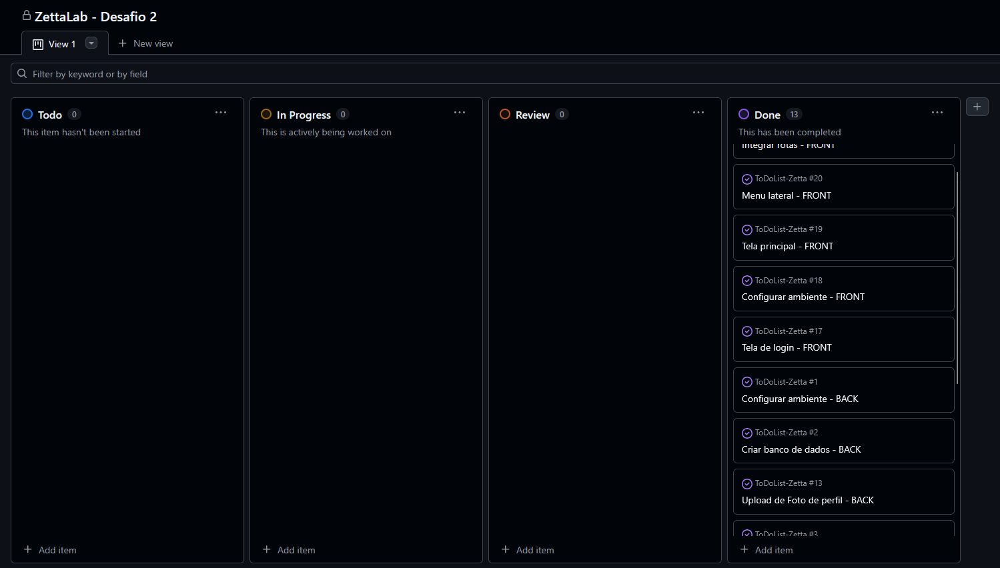

# 🎯 ToDo List

Projeto desenvolvido como solução para o desafio 2 do progama Zetta Lab 2025.

## 📌 Tecnologias Utilizadas

- [TypeScript](https://www.typescriptlang.org/)
- [SASS / SCSS](https://sass-lang.com/)
- [Bootstrap 5](https://getbootstrap.com/)
- [MySQL](https://www.npmjs.com/package/mysql2)
- [Nodemailer](https://nodemailer.com/)
- [Sequelize](https://sequelize.org/)
- [Express](https://expressjs.com/pt-br/)
- [Jsonwebtoken](https://www.npmjs.com/package/jsonwebtoken)
- [Jest](https://jestjs.io/)

## 📁 Estrutura do Projeto

```
├──frontend/
│   ├── public/ 
│   │ └── index.html # Porta de entrada da página
│   ├── src/ 
│   │ ├── components/ # Pastas com arquivos componentizados
│   │ │   ├── auth/ # Componentes de autenticação
│   │ │   ├── layout/ # Componentes de Header e Footer
│   │ │   └── tasks/ # Componentes de Tasks
│   │ ├── pages/ # Pastas com páginas
│   │ │   ├── DashboardPage.ts 
│   │ │   ├── ForgotPasswordPage.ts 
│   │ │   ├── LoginPage.ts 
│   │ │   ├── RegisterPage.ts 
│   │ │   └── ResetPasswordPage.ts
│   │ ├── services/ # Pastas com services
│   │ │   ├── AuthService.ts 
│   │ │   └── TaskService.ts
│   │ ├── styles/ # Estilos scss
│   │ │   ├── components
│   │ │   │  ├── _auth.scss
│   │ │   │  ├── _dashboard.scss
│   │ │   │  ├── _footer.scss
│   │ │   │  └── _header.scss
│   │ │   └── main.scss
│   │ ├── services/ # Pastas com definição das entidades
│   │ │   ├── Auth.ts 
│   │ │   └── Task.ts
│   │ ├── utils/ # Pasta com router
│   │ │   └── router.ts
│   │ └── main.ts # Porta de entrada da aplicação
│   ├── package-lock.json
│   └── package.json
├──src/
│   ├── config/ # Configurações de conexão com o banco de dados e Multer
│   ├── controllers/ # Pasta com controllers
│   │ ├── authController.ts
│   │ ├── taskController.ts
│   │ └── userController.ts
│   ├── middleware/ # Middleware de autenticação
│   │ └── authMiddleware.ts
│   ├── models/ # Entidades Sequelize
│   │ ├── index.ts
│   │ ├── PasswordReset.ts
│   │ ├── Task.ts
│   │ └── User.ts
│   ├── routes/ # Arquivos de rotas
│   │ ├── authRoutes.ts
│   │ ├── index.ts
│   │ ├── taskRoutes.ts
│   │ └── userRoutes.ts
│   ├── services/ # Pasta com services
│   │ ├── authService.ts
│   │ ├── cloudinaryService.ts
│   │ ├── emailService.ts
│   │ ├── taskService.ts
│   │ └── userService.ts
│   ├── utils/ # Pasta com validators
│   │ ├── authValidation.ts
│   │ ├── taskValidation.ts
│   │ └── userValidation.ts
│   └── index.ts # Porta de entrada da aplicação
├──images/ # Imagens usadas na documentação
├──__tests__/ # Arquivos de testes unitários
├── .dockerignore
├── .env 
├── .gitignore 
├── docker-compose
├── dockerfile
├── jest.config.js
├── package-lock.json 
├── package.json
├── README.md 
├── RotasToDoList - InsomniaV5 # Arquivo com requisições para a API, no formato InsomniaV5
├── RotasToDoList.har - InsomniaV5 # Arquivo com requisições para a API, no formato har
├── README.md 
└── tsconfig.json                                        
```

## 📖 Diagramas

### Diagrama de Classe


### Diagrama de Pacote


### Modelo Entidade Relacionamento


## 🌐 Visão Geral

O projeto possui uma implementação completa de um sistema web, com autenticação por token, testes unitários, containerização com Docker e suporte à armazenamento de imagens na nuvem com Cloudinary. O usuário consegue a qualquer momento requisitar uma redefinição de senha, caso seja necessário, sendo as senhas criptografas. Emails de redefinição de senha são enviados com NodeMailer. As redefinições de senha são validadas com base em tokens armazenados em um banco de dados persistente, feito com MYSql e Sequelize. O projeto foi desenvolvido em TypeScript, para garantir maior segurança com tipagem, e Express para o roteamento. Todas as requisições enviadas à API, ao chegarem nos controllers, são verificadas e validadas por validators, que buscam por irregularidades nas requisições. O usuário autenticado consegue realizar um CRUD completo com as Tasks. O front end foi desenvolvido com TypeScript, BootStrap e Scss, seguindo todos os requisitos do primeiro desafio do Zetta Lab 2025.

## 🚀 Como Executar o Projeto

1. **Clone o repositório**:

```bash
git clone https://github.com/JoseJaan/ToDoList-Zetta
cd ToDoList-Zetta
```

2. **Instale as dependências**:
```bash
npm install
cd frontend
npm install
```

3. **Arquivo .env**:
- Na raíz do projeto, crie um arquivo .env e adicione os valores com base na tabela abaixo

4. **Execute o projeto**:
- Back end:
```bash
npm run dev
```
ou
```bash
docker-compose up --build
```
- Front end:
```bash
cd frontend
npm run dev
```

5. **Testes**:
```bash
npm run test
```
O back end é executado em `http://localhost:3000` e o front end em `http://localhost:3001`.

## 🔐 Variáveis de ambiente

| Variável  | Descrição                   | Valor Padrão   |
|-----------|----------------------------|---------------|
| DB_HOST   | Host do banco de dados  | -          |
| DB_USER   | User do banco de dados  | -         |
| DB_PASSWORD   | Senha do Mysql  | -          |
| DB_NAME   | Nome do banco no MySQL    | -   |
| JWT_SECRET   |  Chave JWT  | essa-chave-eh-muito-forte     |
| JWT_EXPIRES_IN   | Validade JWT     | 24h            |
| GMAIL_USER   | Usuário google para envio de emails   | joseacerbialmeida@gmail.com          |
| GMAIL_APP_PASSWORD   | Chave do google    | wlni omwf gpvf xeve          |
| CLOUDINARY_API_SECRET | Senha da API do Cloudinary    | 8-_eSBfJn4nx6qqpkPIrLWa32tQ         |
| CLOUDINARY_CLOUD_NAME  | Nome da cloud no Cloudinary    | dxqcebqx3          |
| CLOUDINARY_API_KEY   | Chave da API do Cloudinary    | 612318217586866          |
| FRONTEND_URL | Url Front  | http://localhost:3001          |

## 📨 Rotas da API

### 🔄 Health Check
- **GET** `/`
- **Descrição**: Verifica se o servidor está online.

---

### 👤 Usuários

### 📥 Criar usuário
- **POST** `/api/users`
- **Body**:
  ```json
  {
    "name": "João da Silva",
    "email": "joao@gmail.com",
    "password": "senha123"
  }
- Descrição: Cria um novo usuário no sistema.

### 🔍 Buscar todos os usuários
- **GET** `/api/users`
- Descrição: Retorna todos os usuários cadastrados.

### 🔬 Buscar usuário por ID
- **GET** `/api/users/{id}`
- Descrição: Retorna os dados de um usuário específico.

### ✏️ Atualizar usuário
- **PUT** `/api/users/{id}`
- **Body**:
  ```json
  {
    "name": "Novo Nome",
    "email": "novoemail@gmail.com"
  }
- Descrição: Atualiza os dados de um usuário existente.

### ✏️ Atualizar foto de perfil do usuário
- **PUT** `/api/users/{id}/profile-image`
- **Multipart**:
  ```
    profileImage
  
- Descrição: Atualiza a foto de perfil do usuário

### ⛔ Deletar usuário
- **DELETE** `/api/users/{id}`
- Descrição: Remove um usuário do sistema.

### 👤 Autenticação

### 🔐 Login
- **POST** `/api/auth/login`
- **Body**:
  ```json
  {
    "email": "joao@gmail.com",
    "password": "senha123"
  }
- Descrição: Realiza login e retorna o token JWT.

### 🔐 Requisição de redefinição de senha
- **POST** `/api/auth/forgot-password`
- **Body**:
  ```json
  {
    "email": "joao@gmail.com"
  }
- Descrição: Envia um e-mail com link para redefinição de senha.

### 🔐 Redefinir senha
- **POST** `/api/auth/forgot-password`
- **Body**:
  ```json
  {
    "token": "token_recebido_no_email",
    "newPassword": "novasenha123" 
  }
- Descrição: Redefine a senha usando um token válido.

### 🎯 Tasks

### ➕ Criar task
- **POST** `/api/tasks`
- **Headers**:
    - Authorization: Bearer <token> 
- **Body**:
  ```json
  {
    "name": "Estudar TypeScript",
    "description": "Revisar interfaces e classes"
  }
- Descrição: Cria uma nova tarefa para o usuário autenticado.

### 📃 Listar todas as tasks
- **GET** `/api/tasks`
- **Headers**:
    - Authorization: Bearer <token> 
- Descrição: Lista todas as tarefas do usuário autenticado.

### ✏️ Atualizar task
- **PUT** `/api/tasks/{id}`
- **Headers**:
    - Authorization: Bearer <token> 
- **Body**:
  ```json
  {
    "name": "Nova tarefa",
    "description": "Descrição atualizada",
    "status": "concluída"
  }
- Descrição: Atualiza uma tarefa existente.

### ⛔ Deletar task
- **PUT** `/api/tasks/{id}`
- **Headers**:
    - Authorization: Bearer <token> 
- Descrição: Deleta uma tarefa.

## 🤔 Informações adicionais
O projeto foi desenvolvido seguindo as boas práticas de código e versionamento presentes no E-book disponibilizado. A integração com o Cloudinary para o armazenamento de imagens tinha como objetivo a possibilidade do usuário ter uma foto de perfil personalizável e também conseguir fazer upload de fotos por task. O upload de foto de perfil foi implementado apenas no back end, enquando as fotos por task não foram implementadas por questão de tempo. O desenvolvimento do projeto foi organizado com base num quadro Kanban integrado ao Git Hub, como mostra a imagem a seguir.


